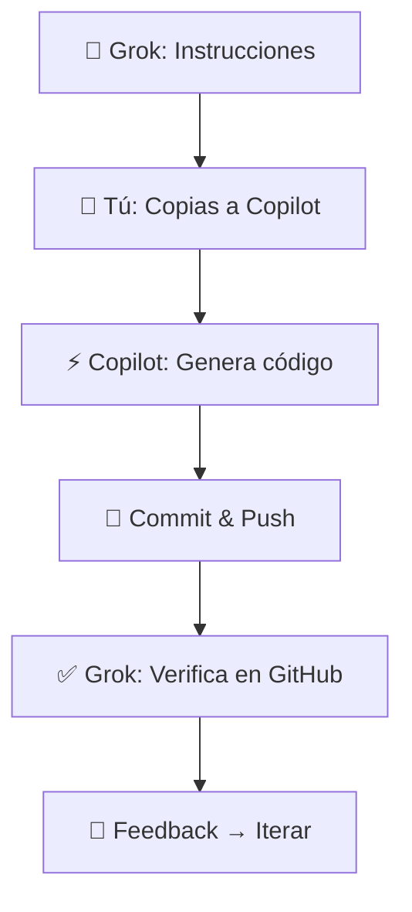

# 🚀 AOK Apps – Suite de Soluciones Técnicas

[](https://github.com/Aoneken/aok-apps)
[](https://nodejs.org/)
[](https://www.docker.com/)
[](https://www.postgresql.org/)

> **Repositorio raíz de 4 aplicaciones con sinergias técnicas.**
> Entorno: GitHub Codespaces | Stack: Node.js, PostgreSQL, Docker | IA: GitHub Copilot

---

## 📊 Informe Técnico del Entorno (Integrado)

### Codespace
- **Nombre:** `gory-phantom-7vx6r4jxjrwwhrg79`
- **SO:** Ubuntu 24.04.2 LTS (Noble Numbat)
- **Kernel:** Linux 6.8.0-1030-azure
- **CPU:** AMD EPYC 7763, 2 núcleos
- **RAM:** 8 GB (5.2 GB disponibles)
- **Disco:** 32 GB total, 20 GB libres
- **Docker:** v28.3.1 (DinD habilitado)
- **Network:** Docker en modo `host`
- **Uptime:** Sistema estable

### Lenguajes y Herramientas

| Tecnología | Versión | Uso Principal |
|-----------|---------|---------------|
| Node.js   | v22.17.0 | Backend principal |
| npm       | 9.8.1 | Gestión de paquetes |
| pnpm      | 10.13.1 | Alternativa rápida |
| Python    | 3.12.1 | Scripts/ML |
| Ruby      | 3.4.1 | Disponible |
| PHP       | 8.3.14 | Disponible |
| Java      | OpenJDK 21.0.7 LTS | Disponible |
| Go        | 1.24.5 | Disponible |
| Git       | 2.50.1 | Control de versiones |
| Docker    | 28.3.1 | Contenedores |
| kubectl   | v1.33.2 | Kubernetes |
| Helm      | v3.18.4 | Charts K8s |
| GitHub CLI| 2.75.0 | Automatización |

> **GitHub Copilot:** Activo con modelos:
> - **Claude Sonnet 4.5** (documentación, arquitectura)
> - **Grok Code Fast 1** (código rápido, prototipos)

---

## 🎯 Proyectos

| # | Nombre | Descripción | Repos |
|---|--------|-------------|-------|
| 1️⃣ | **Reservas Deportivas** | Sistema multi-app: admin de instalaciones + app de jugadores con reservas, mensajería y reseñas | `reservas-admin`, `reservas-jugadores` |
| 2️⃣ | **Gestión Financiera** | Plataforma contable: cajas, inversiones (acciones, bonos, cripto), dividendos y comisiones | `gestion-financiera` |
| 3️⃣ | **Data Scraper** | Sistema de ingesta y almacenamiento desde fuentes digitales (boletines, noticias, informes) | `data-scraper` |
| 4️⃣ | **Channel Manager** | Sincronización de calendarios vía API (Airbnb, Booking, Expedia) con bloqueo automático | `channel-manager` |

---

## 🔗 Sinergias Técnicas

### Matriz de Reutilización

| Componente | Proyectos Afectados | Nivel de Reutilización |
|-----------|---------------------|----------------------|
| **Autenticación (JWT)** | 1, 2, 4 | 🔴 Alta |
| **Calendarios** | 1, 4 | � Alta |
| **ETL / Scraping** | 2, 3 | � Alta |
| **Notificaciones** | 1, 2, 3, 4 | 🔴 Alta |
| **Backend API** | Todos | 🟡 Media-Alta |
| **Modelos BD** | Todos | 🟡 Media |

### Tabla de Sinergias por Pareja

| Componente / Pareja | 1 y 2 | 1 y 3 | 1 y 4 | 2 y 3 | 2 y 4 | 3 y 4 |
|---------------------|-------|-------|-------|-------|-------|-------|
| Autenticación       | 🔴 Alta | 🟡 Media | 🔴 Alta | 🟡 Media | 🟢 Baja | 🟢 Baja |
| Backend/API         | 🟡 Media | 🟡 Media | 🔴 Alta | 🔴 Alta | 🟢 Baja | 🔴 Alta |
| Modelos BD          | 🔴 Alta | 🟡 Media | 🔴 Alta | 🔴 Alta | 🟡 Media | 🟡 Media |
| Servicios           | 🔴 Alta | 🔴 Alta | 🔴 Alta | 🔴 Alta | 🟡 Media | 🔴 Alta |

---

## 🛠️ Stack Común (Recomendado)

```yaml
Backend: Node.js + Express
ORM: Prisma
BD: PostgreSQL
Cache: Redis (calendarios y sesiones)
Auth: JWT + bcrypt
Queue: Bull/BullMQ (procesamiento asíncrono)
Notificaciones: SendGrid (email) + Firebase (push)
Deploy: Docker + Railway/Render
CI/CD: GitHub Actions
Testing: Jest + Supertest
```

---

## 📁 Arquitectura de Repositorios

### ✅ Estrategia: Multirepo por Aplicación

**1 repositorio = 1 microservicio** – Ideal para principiantes: simplicidad, aislamiento, deploys independientes.

```bash
proyectos/
├── reservas-admin/          # App admin de reservas deportivas
├── reservas-jugadores/      # App jugadores (reservas + mensajería)
├── gestion-financiera/      # Plataforma financiera completa
├── data-scraper/            # Sistema de ingesta de datos
└── channel-manager/         # Sincronizador de calendarios
```

> **Reutilización:** Mismo stack + copy-paste inicial → futuro repo `shared-libs` para paquetes comunes

---

## 📦 Plantilla de Repo

```bash
reservas-admin/
├── src/
│   ├── routes/           # Definición de endpoints
│   ├── controllers/      # Lógica de negocio
│   ├── models/           # Modelos de datos
│   ├── middleware/       # Auth, validación, logs
│   ├── services/         # Servicios externos
│   └── server.js         # Entry point
├── prisma/
│   └── schema.prisma     # Esquema de BD
├── tests/                # Tests unitarios e integración
├── .env.example          # Variables de entorno
├── package.json
├── Dockerfile
├── docker-compose.yml
├── .github/
│   └── workflows/        # GitHub Actions
└── README.md
```

---

## 🤖 Flujo de Trabajo con IA



### Roles Definidos

1. **🧠 Grok (Ingeniero Senior)** → Instrucciones en lenguaje natural
2. **📨 Tú (Mensajero)** → Transmites a GitHub Copilot
3. **⚡ Copilot** → Genera código en el Codespace
4. **💾 Commit & Push** → Subes a GitHub
5. **🔄 Feedback → Iterar** → Ciclo continuo

### Modelos por Tarea

| Tarea | Modelo Recomendado | Razón |
|-------|-------------------|-------|
| 📝 Documentación técnica | **Claude Sonnet 4.5** | Precisión arquitectónica |
| 🏗️ Diseño de arquitectura | **Claude Sonnet 4.5** | Análisis profundo |
| ⚡ Código rápido/prototipos | **Grok Code Fast 1** | Velocidad |
| 🐛 Debugging complejo | **Claude Sonnet 4.5** | Razonamiento detallado |
| 🔧 Scripts de automatización | **Grok Code Fast 1** | Implementación directa |

---

## 🗓️ Roadmap

| Semana | Tarea | Entregable |
|--------|-------|-----------|
| **1** | Crear 5 repositorios | Repos con README inicial |
| **2** | Backend base con JWT | Endpoint `/health` + auth |
| **3** | Replicar en otros proyectos | Mismo stack en todos |
| **4** | Primera feature real | Funcionalidad completa |
| **5** | Dockerizar | `docker-compose up` funcional |
| **6** | CI/CD | Tests automáticos en PRs |
| **7+** | Features específicas | Desarrollo por proyecto |

---

## 🚀 Inicio Rápido

### Entorno de Desarrollo Autónomo

Este repositorio está **100% configurado** para trabajar inmediatamente:

```bash
# Clonar y abrir en Codespaces
gh repo clone Aoneken/aok-apps
code aok-apps

# O directamente en Codespaces:
# https://github.com/Aoneken/aok-apps → Code → Create codespace
```

**El entorno incluye:**

✅ **VS Code** configurado con Prettier, ESLint, extensiones recomendadas
✅ **Dev Container** con Node.js 22, PostgreSQL client, Docker
✅ **Docker Compose** para base de datos PostgreSQL
✅ **GitHub Actions** para CI/CD automático
✅ **Configuración Prisma** lista para usar
✅ **Debugging** preconfigurado (F5)

### Iniciar Base de Datos

```bash
docker-compose up -d
# PostgreSQL corriendo en localhost:5432
# DB: reservas | User: admin | Password: secret
```

### Próximos Pasos

### Checklist Inmediato

- [x] **Configurar entorno de desarrollo** ✅
- [ ] **Crear repositorios en GitHub**
  ```bash
  gh repo create Aoneken/reservas-admin --public
  gh repo create Aoneken/reservas-jugadores --public
  gh repo create Aoneken/gestion-financiera --public
  gh repo create Aoneken/data-scraper --public
  gh repo create Aoneken/channel-manager --public
  ```

- [ ] **Implementar backend base en `reservas-admin`**
  ```bash
  npm init -y
  npm install express prisma @prisma/client jsonwebtoken bcrypt dotenv
  npx prisma init
  ```

- [ ] **Crear estructura base y endpoint `/health`**

- [ ] **Pedir siguiente instrucción a Grok** 🧠

---

## 👤 Maintainer

**Aoneken**
📧 comercial@aoneken.com
🔗 [GitHub](https://github.com/Aoneken)

---

## 📊 Estado del Proyecto


**Versión:** 1.0.0
**Última actualización:** 31 de octubre de 2025

---

<div align="center">

**🌟 Construido con GitHub Copilot & Grok IA 🌟**

</div>
